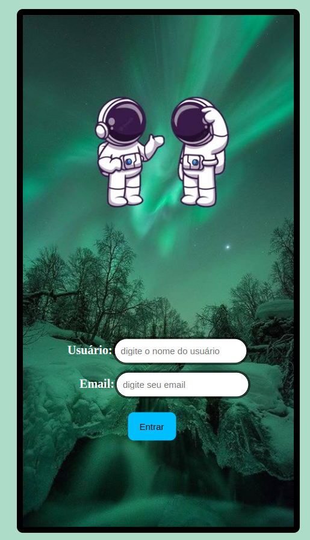

# 🌌 Universe

Este projeto apresenta uma página web com visual imersivo inspirado no universo. Criado durante minha jornada de estudos em Desenvolvimento Web Full Stack, o objetivo é explorar conceitos de design visual, posicionamento de elementos, tipografia e integração de imagens com layout responsivo básico.

## 🔗 Acesse o Projeto

👉 [Clique aqui para visualizar](https://jaqueline-gotardi.github.io/Universe/)

## 🛠️ Tecnologias Utilizadas

- **HTML5** – Estruturação da página
- **CSS3** – Estilização com foco em identidade visual
- **Git + GitHub** – Versionamento e deploy com GitHub Pages

## 🎨 Funcionalidades

- Layout com fundo espacial e visual impactante
- Uso de fontes personalizadas para ambientação temática
- Imagem central ilustrando o conceito do projeto
- Botão estilizado com hover (pode ser futuro ponto de interação)

## 🎯 Objetivo do Projeto

- Praticar o uso de imagens e tipografias criativas
- Aplicar técnicas de centralização, espaçamento e responsividade inicial
- Explorar estilo visual diferenciado com CSS
- Publicar um projeto completo no GitHub Pages

## 🚀 Possíveis melhorias futuras

- Tornar o site 100% responsivo
- Criar páginas adicionais com navegação temática
- Adicionar efeitos de animação com JavaScript 
- Incluir interatividade no botão (ex: direcionar para conteúdo extra)
