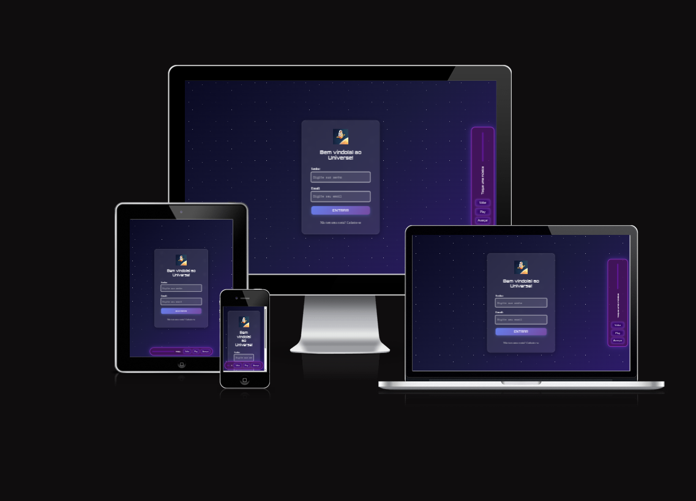

# 🚀 Projeto Universe  

💙 **“Explorar o desconhecido é o primeiro passo para criar algo incrível.”**

O **Universe** é um projeto que nasceu lá em 2022, como um protótipo escolar simples feito em HTML, CSS e PowerPoint para agrupar desenhos da tela. Inicialmente, o tema dele era focado totalmente em algo moderno + pegada infantil, até que neste ano (2025) decidi refazê-lo por conta própria, focando em mais funcionalidades e adotando um desing moderno.  
Hoje, ele evoluiu para um **site completo, interativo e moderno**, desenvolvido com **HTML, CSS e JavaScript puro**, trazendo uma experiência única de exploração pelo espaço. 🌌  



---

## 🌠 Sobre o Projeto  

O **Universe** é uma jornada digital por constelações, planetas, galáxias e fenômenO Universe é uma **jornada digital pelo cosmos**, explorando constelações, planetas, galáxias e fenômenos astronômicos. Cada tela foi pensada para oferecer uma experiência **visualmente imersiva** e **conectada à curiosidade de explorar o desconhecido**.
os astronômicos.  
Cada tela foi pensada para oferecer uma experiência envolvente, visualmente imersiva e conectada à curiosidade de explorar o desconhecido.  

O projeto conta com:  
- **Tela de Login e Cadastro**: com verificação de campos e sistema de criação de conta fictício (frontend).  
- **Tela Principal (Menu)**: acesso às opções “Explorar o Universo”, “Informações Astronômicas”, “Eventos Cósmicos” e muito mais.  
- **Sessões Interativas**: com informações sobre:
  - Constelações famosas (Órion, Cruzeiro do Sul, Andrômeda, etc.)  
  - Eventos astronômicos (Eclipses, Chuvas de Meteoros, Conjunções)  
  - Planetas do Sistema Solar — incluindo a Lua e o Sol ☀️🌙  
- **Tela de Perfil do Usuário**: onde é possível adicionar nome, foto, interesses e uma breve descrição.  
- **Tela de Criadores**: destacando o trabalho original de 2022 e a nova versão atualizada.  
- **Tela de Apagar Conta**: com mensagem personalizada e interação dinâmica.  
- **Trilha Sonora Espacial**: o usuário pode ouvir até 5 músicas-tema durante a navegação. 🎶  
- **Pesquisa Integrada com API da NASA:** resultados filtrados, com imagem, descrição, data e localização.  

---

## 💻 Backend Local

O projeto agora possui **backend local** para consumir a **API gratuita da NASA**.  
Isso permite trazer resultados reais do universo diretamente para o seu navegador.  

### Como rodar o backend na sua máquina

1. Clone o repositório:  
```bash
git clone https://github.com/Jaqueline-Gotardi/projeto-universe.git
```

2. Entre na pasta do backend:
```bash
cd projeto-universe/backend
```

3. Instale as dependências:
```bash
npm install
```

4. Rode o servidor local:
```bash
node server.js
```

5. O servidor vai iniciar em:
```http://localhost:3000```

OBS: Abra o *index.html* do frontend no navegador (Github Pages ou Live Server)
A API é gratuita, então use com moderação, para não exceder o limite de requisições. É apenas para fins de estudo.

---

## 🖌️ Melhorias Recentes

1. Layout Dinâmico: quando a pesquisa é exibida, os elementos mudam para row, deixando a experiência mais imersiva.

2. Animação de Fundo: ativada junto com os resultados, trazendo vida ao menu.

3. Responsividade: melhorias iniciais implementadas, ainda ajustando telas menores aos poucos.

4. Integração com API da NASA: traz imagens e informações reais do cosmos.

---

## 🧠 Aprendizados e Desafios  

Cada linha de código representa uma descoberta, e alguns erros de vírgula também! 😅  

Durante o desenvolvimento, aprimorei habilidades como:  
- Manipulação de DOM;
- Estruturação de formulários;
- Navegação dinâmica entre seções;  
- Lógica condicional com `if`;    
- Criação de telas conectadas por JavaScript;  

Além disso, aprendi muito sobre **design de interface**, **consistência visual** e **experiência do usuário (UX)**, usando o **Lovart IA** para gerar imagens temáticas que reforçam o clima espacial. 🌠  

---

## 💭 Próximas Explorações  

Planejo incluir:  
- Integração com **banco de dados**;  
- Implementaçã de automação; 
- Simulação **3D interativa**; 

Tudo isso mantendo o foco na experiência do usuário, e no aprendizado contínuo, 1% melhor por dia. 💙  

---

## 🛠️ Tecnologias Utilizadas  

- **HTML5**: Estrutura e semântica;
- **CSS3**: Estilo, animações e tema neon espacial; 
- **JavaScript (puro)**: Lógica, interatividade e controle das telas;  
- **Lovart IA**: Geração de imagens do universo;
- **Node.Js**: Para Backend local;
---

## 🌌 Acesse o Projeto  

👉 **[Explorar o Universe aqui](https://jaqueline-gotardi.github.io/projeto-universe/)**  

---

## 💙 Créditos e Inspiração  

- Protótipo original criado no **Instituto Federal do Amazonas - Campus Eirunepé (IFAM)** -2022;
- Releitura e desenvolvimento atual por **Jaqueline Gotardi**; 

---

🕵️‍♀️ **Missão em andamento...**  
Mais descobertas estão a caminho. . .

---

**No Universo do código, cada erro é uma nova estrela sendo descoberta.** 💙
